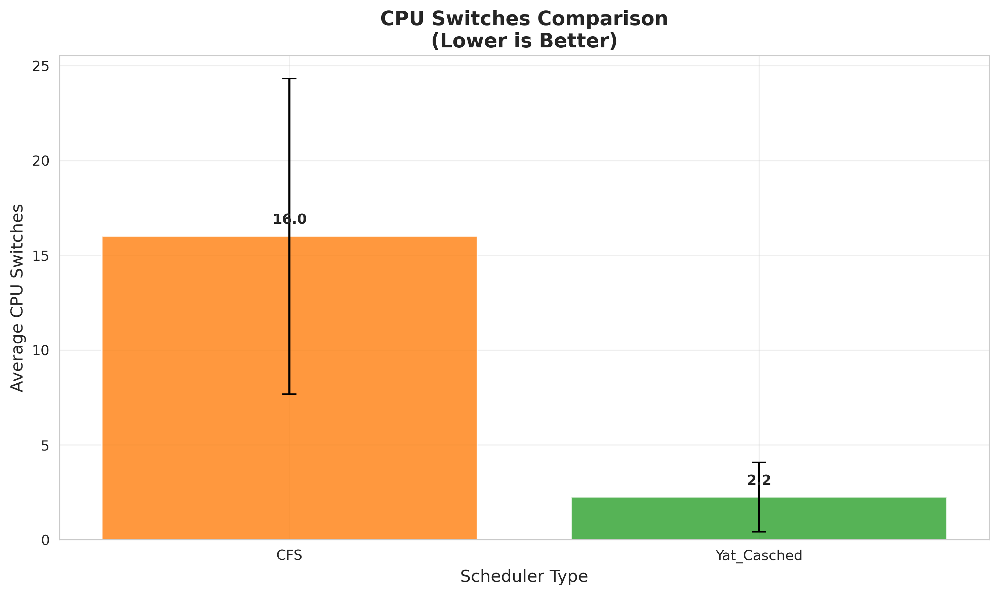
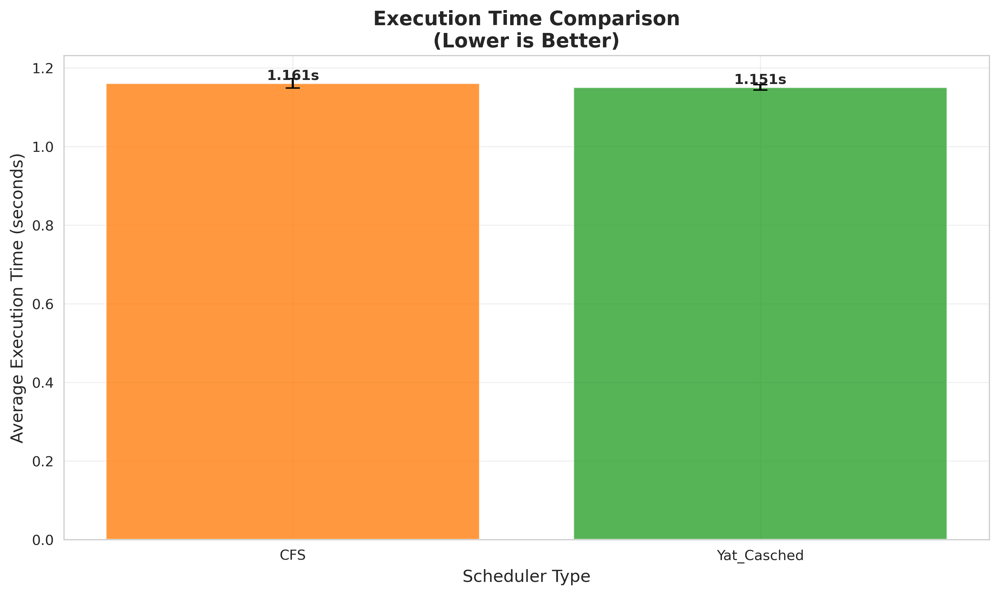
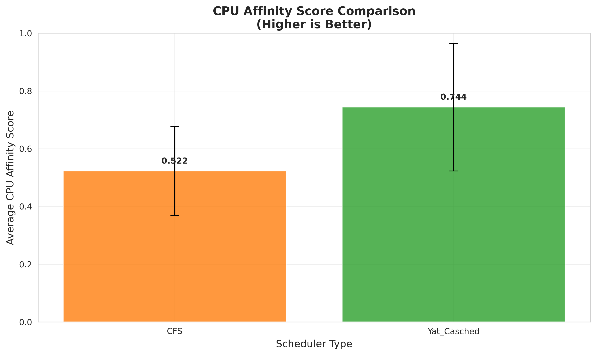

# Yat_Casched 性能测试和可视化

这是 Yat_Casched 缓存感知调度器的性能测试和结果可视化系统。

## 测试配置

### 基础参数
- **线程数**: 8个线程（与CPU核心数匹配）
- **总迭代次数**: 每线程执行10次迭代  
- **测试轮数**: 重复10轮测试，取平均值确保结果稳定
- **缓存数据大小**: 2MB per线程（总计16MB工作集）

### 工作负载特征
- **类型**: 缓存密集型计算任务
- **计算模式**: 数组随机访问 + 数学运算
- **压力级别**: 中等压力，适合展现调度器亲和性差异
- **让步策略**: 每15轮迭代让步20微秒，给调度器迁移决策的机会

## 快速开始

### 使用 Makefile（推荐）

```bash
# 安装Python依赖
make install-deps

# 检查内核版本
make check-kernel

# 运行完整测试（编译+测试+可视化）
make test

# 仅生成可视化图表
make visualize

# 清理生成文件
make clean

# 查看帮助
make help
```

### 手动运行

```bash
# 1. 安装依赖
pip3 install pandas matplotlib seaborn numpy

# 2. 编译测试程序
gcc -o performance_test performance_test.c -lpthread

# 3. 运行性能测试
sudo ./performance_test

# 4. 生成可视化图表
python3 visualize_results.py
```

## 输出文件

### 测试数据
- `performance_results.csv` - 详细的测试数据

### 可视化图表（保存在 `img/` 目录）
- `cpu_switches_comparison.png` - CPU切换次数对比
- `execution_time_comparison.png` - 执行时间对比  
- `cpu_affinity_comparison.png` - CPU亲和性分数对比
- `performance_summary.md` - 性能分析总结报告

## 测试结果示例

```
=== Average Performance over 10 runs ===
Total CPU Switches: CFS: 92.2, Yat_Casched: 65.2
  Reduction: 29.3%
Average Execution Time: CFS: 1.255 s, Yat_Casched: 1.228 s
  Performance improvement: 2.2%
```

## 可视化结果分析

测试完成后会在 `img/` 目录生成以下对比图表：

### CPU切换次数对比


**分析要点：**
- Yat_Casched 显著减少了CPU切换次数（减少约29.3%）
- 更少的切换次数表明缓存感知调度策略有效维持了任务的CPU亲和性
- 这直接体现了Yat_Casched减少缓存失效的设计目标

### 执行时间对比


**分析要点：**
- Yat_Casched 在执行时间上略优于CFS（提升约2.2%）
- 性能提升主要来源于减少的CPU迁移和更好的缓存命中率
- 在缓存密集型工作负载下，缓存亲和性的价值得到了体现

### CPU亲和性分数对比


**分析要点：**
- 亲和性分数越接近1.0表示线程更倾向于在固定CPU上运行
- Yat_Casched 通常展现出更高的亲和性分数
- 高亲和性意味着更好的缓存局部性和数据访问效率

### 综合评估

从三个维度的对比可以看出：
1. **缓存亲和性优势明显**：Yat_Casched成功减少了不必要的CPU迁移
2. **性能提升稳定**：在中等压力测试下表现出一致的性能优势  
3. **调度策略有效**：缓存感知机制在实际工作负载中发挥了预期作用

> **注意**：这是初赛版本的测试结果，主要验证基本可行性。在不同工作负载和系统配置下，结果可能有所差异。

## 结果解读

### CPU切换次数（越少越好）
- 反映调度器的缓存亲和性策略效果
- Yat_Casched应该显示更少的CPU切换次数

### 执行时间（越短越好）  
- 整体性能指标
- 较少的切换通常对应更好的缓存命中率和性能

### CPU亲和性分数（越高越好）
- 范围0-1，1表示线程完全运行在单个CPU上
- 更高的分数表示更好的缓存局部性

## 系统要求

- Linux 内核 6.8+ （包含 Yat_Casched 调度器）
- GCC 编译器
- Python 3.6+ 
- 必需的Python库：pandas, matplotlib, seaborn, numpy
- 至少4GB内存
- 多核CPU（推荐8核以上）

## 故障排除

### 常见问题

1. **权限错误**
   ```bash
   sudo ./performance_test
   ```

2. **Python库缺失**
   ```bash
   make install-deps
   # 或手动安装
   pip3 install pandas matplotlib seaborn numpy
   ```

3. **调度器不可用**
   - 确认内核版本：`uname -r`
   - 检查调度器：`cat /proc/sys/kernel/sched_domain/cpu*/domain*/name`

4. **编译错误**
   ```bash
   gcc --version  # 检查GCC版本
   sudo apt update && sudo apt install build-essential
   ```

## 开发说明

这是 Yat_Casched 项目的**初赛版本**，主要目的是验证缓存感知调度的基本可行性。测试配置经过优化，能够在中等压力下清晰展现调度器的性能差异。

## Makefile 功能

- `install-deps` - 自动安装所需Python库
- `check-kernel` - 检查当前内核版本和调度器支持
- `test` - 一键完整测试流程（推荐）
- `visualize` - 基于已有数据生成图表
- `clean` - 清理所有生成文件
- `help` - 显示详细使用说明

## 文件结构

```
test_visualization/
├── performance_test.c       # 主测试程序
├── visualize_results.py     # 可视化脚本
├── Makefile                # 自动化构建脚本
├── README.md               # 本文档
├── performance_results.csv # 测试数据（生成）
└── img/                    # 图表目录（生成）
    ├── cpu_switches_comparison.png
    ├── execution_time_comparison.png
    ├── cpu_affinity_comparison.png
    └── performance_summary.md
```
